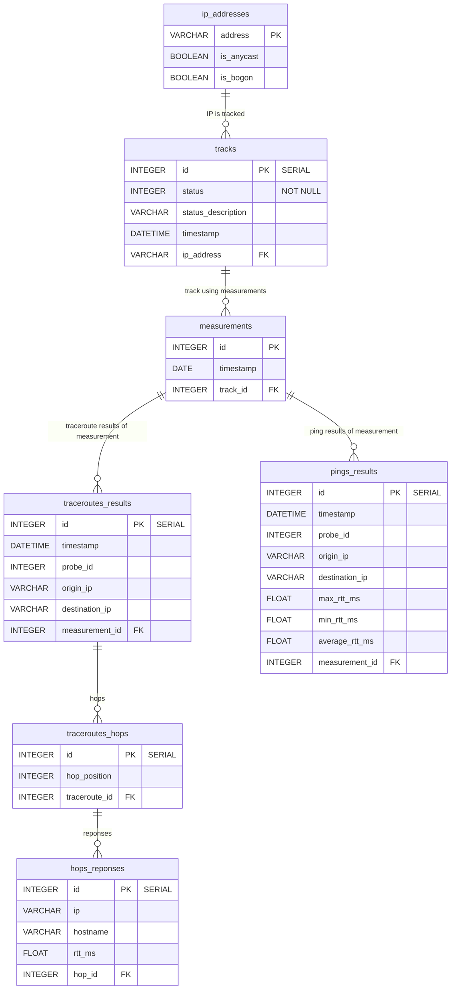

# Hunter Entity-Relationship Description

## Sistem description
This diagram shows the relations between database tables in the Hunter system.

## Entity-Relationship Diagram

### Symbols legend
- `PK`: Primary Key
- `FK`: Foreign Key
- `UK`: Unique Key
- `||--o{`: One-to-Many relation
- `}o--o{`: Many-to-Many relation
