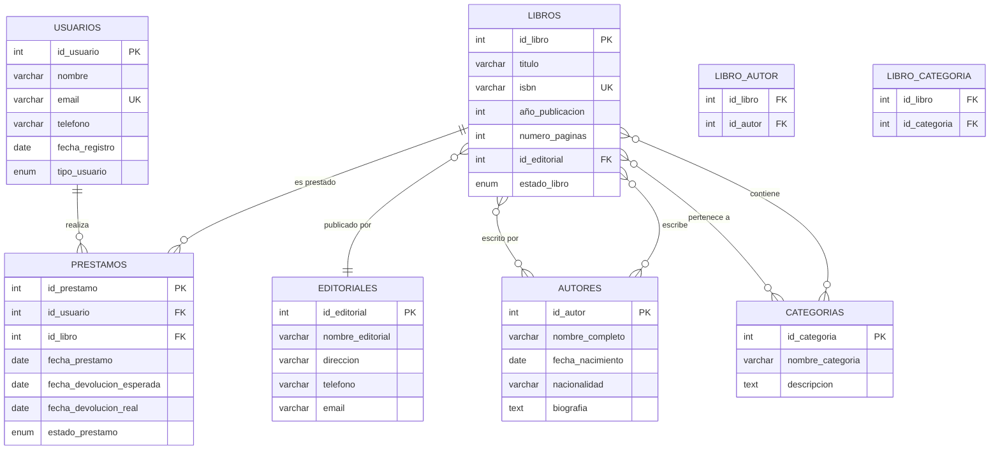

# Diagrama ER - Sistema de Biblioteca

## Descripción del Sistema
Este diagrama muestra las relaciones entre las tablas principales de un sistema de gestión de biblioteca.

## Diagrama de Entidad-Relación

## Explicación de las Relaciones

### Relaciones Principales:
- **USUARIOS → PRESTAMOS**: Un usuario puede tener múltiples préstamos (1:N)
- **LIBROS → PRESTAMOS**: Un libro puede ser prestado múltiples veces (1:N)
- **EDITORIALES → LIBROS**: Una editorial puede publicar múltiples libros (1:N)

### Relaciones Muchos a Muchos:
- **LIBROS ↔ AUTORES**: Un libro puede tener varios autores y un autor puede escribir varios libros
- **LIBROS ↔ CATEGORIAS**: Un libro puede pertenecer a varias categorías y una categoría puede contener varios libros

### Tablas de Unión:
- **LIBRO_AUTOR**: Resuelve la relación muchos a muchos entre libros y autores
- **LIBRO_CATEGORIA**: Resuelve la relación muchos a muchos entre libros y categorías

## Leyenda de Símbolos
- `PK`: Primary Key (Clave Primaria)
- `FK`: Foreign Key (Clave Foránea)
- `UK`: Unique Key (Clave Única)
- `||--o{`: Relación uno a muchos
- `}o--o{`: Relación muchos a muchos
- `}o--||`: Relación muchos a uno