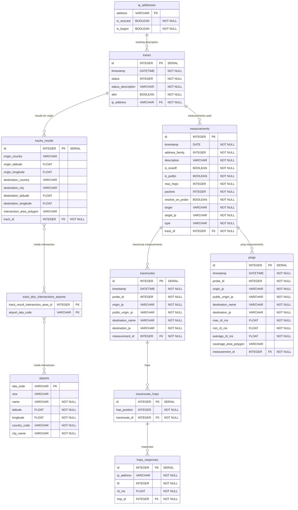

# Hunter Entity-Relationship Description

## Sistem description
This diagram shows the relations between database tables in the Hunter system.

## Entity-Relationship Diagram



### Symbols legend
- `PK`: Primary Key
- `FK`: Foreign Key
- `UK`: Unique Key
- `||--o{`: One-to-Many relation
- `}o--||`: Many-to-One relation
- `}o--o{`: Many-to-Many relation

## Data dictionary

### Table: `ip_addresses`

| Column     | Type         | Description                                     |
|------------|--------------|-------------------------------------------------|
| address    | VARCHAR (PK) | IP address in string format                     |
| is_anycast | BOOLEAN      | Flag indicating if the IP is an anycast address |
| is_bogon   | BOOLEAN      | Flag indicating if the IP is a bogon address    |

```sql
CREATE TABLE ip_addresses (
    address VARCHAR PRIMARY KEY,
    is_anycast BOOLEAN NOT NULL,
    is_bogon BOOLEAN NOT NULL
);
```

### Table: `airports`

| Column       | Type         | Description                           |
|--------------|--------------|---------------------------------------|
| iata_code    | VARCHAR (PK) | IATA airport code (3 letters)         |
| size         | VARCHAR      | Airport size classification           |
| name         | VARCHAR      | Full name of the airport              |
| latitude     | FLOAT        | Airport latitude coordinate           |
| longitude    | FLOAT        | Airport longitude coordinate          |
| country_code | VARCHAR      | Country code where airport is located |
| city_name    | VARCHAR      | City name where airport is located    |

```sql
CREATE TABLE airports (
    iata_code VARCHAR PRIMARY KEY,
    size VARCHAR,
    name VARCHAR NOT NULL,
    latitude FLOAT NOT NULL,
    longitude FLOAT NOT NULL,
    country_code VARCHAR NOT NULL,
    city_name VARCHAR NOT NULL
);
```

### Table: `tracks`

| Column             | Type         | Description                                                                |
|--------------------|--------------|----------------------------------------------------------------------------|
| id                 | INTEGER (PK) | Unique ID of the track                                                     |
| timestamp          | DATETIME     | Timestamp when the track was created                                       |
| status             | INTEGER      | Status of track execution. 0 if FINISHED, 1 if IN_PROGRESS and -1 if ERROR |
| status_description | VARCHAR      | Description of the current status of the track. If ERROR, an error message |
| slim               | BOOLEAN      | Flag indicating if track uses slim mode                                    |
| ip_address         | VARCHAR (FK) | IP address being tracked                                                   |

```sql
CREATE TABLE tracks (
    id SERIAL PRIMARY KEY,
    timestamp DATETIME NOT NULL,
    status INTEGER NOT NULL,
    status_description VARCHAR NOT NULL,
    slim BOOLEAN NOT NULL,
    ip_address VARCHAR NOT NULL REFERENCES ip_addresses(address) ON DELETE CASCADE
);
```

### Table: `tracks_results`

| Column                       | Type         | Description                                    |
|------------------------------|--------------|------------------------------------------------|
| id                           | INTEGER (PK) | Unique ID of the track result                  |
| origin_country               | VARCHAR      | Country code of the origin location            |
| origin_latitude              | FLOAT        | Latitude coordinate of the origin              |
| origin_longitude             | FLOAT        | Longitude coordinate of the origin             |
| destination_country          | VARCHAR      | Country code of the destination location       |
| destination_city              | VARCHAR      | City name of the destination                   |
| destination_latitude         | FLOAT        | Latitude coordinate of the destination         |
| destination_longitude        | FLOAT        | Longitude coordinate of the destination        |
| intersection_area_polygon    | VARCHAR      | Polygon defining the intersection area         |
| track_id                     | INTEGER (FK) | Reference to the associated track              |

```sql
CREATE TABLE tracks_results (
    id SERIAL PRIMARY KEY,
    origin_country VARCHAR,
    origin_latitude FLOAT,
    origin_longitude FLOAT,
    destination_country VARCHAR,
    destination_city VARCHAR,
    destination_latitude FLOAT,
    destination_longitude FLOAT,
    intersection_area_polygon VARCHAR,
    track_id INTEGER NOT NULL REFERENCES tracks(id) ON DELETE CASCADE
);
```

### Table: `track_disc_intersections_airports`

| Column                            | Type         | Description                                  |
|-----------------------------------|--------------|----------------------------------------------|
| track_result_intersection_area_id | INTEGER (PK) | ID of the track intersection area            |
| airport_iata_code                 | VARCHAR (PK) | IATA code of the airport in the intersection |

```sql
CREATE TABLE track_disc_intersections_airports (
    track_result_intersection_area_id INTEGER,
    airport_iata_code VARCHAR,
    PRIMARY KEY (track_result_intersection_area_id, airport_iata_code),
    FOREIGN KEY (track_result_intersection_area_id) REFERENCES tracks_results(id) ON DELETE CASCADE,
    FOREIGN KEY (airport_iata_code) REFERENCES airports(iata_code) ON DELETE CASCADE
);
```

### Table: `measurements`

| Column           | Type         | Description                                    |
|------------------|--------------|------------------------------------------------|
| id               | INTEGER (PK) | Unique ID of the measurement                   |
| timestamp        | DATE         | Date when the measurement was taken            |
| address_family   | INTEGER      | IP address family (4 for IPv4, 6 for IPv6)     |
| description      | VARCHAR      | Description of the measurement                 |
| is_oneoff        | BOOLEAN      | Flag indicating if it's a one-time measurement |
| is_public        | BOOLEAN      | Flag indicating if measurement is public       |
| max_hops         | INTEGER      | Maximum number of hops allowed                 |
| packets          | INTEGER      | Number of packets sent                         |
| resolve_on_probe | BOOLEAN      | Flag to resolve hostnames on probe             |
| target           | VARCHAR      | Target hostname or IP address                  |
| target_ip        | VARCHAR      | Resolved target IP address                     |
| type             | VARCHAR      | Type of measurement (ping, traceroute, etc.)   |
| track_id         | INTEGER (FK) | Reference to the associated track              |

```sql
CREATE TABLE measurements (
    id INTEGER PRIMARY KEY,
    timestamp DATE NOT NULL,
    address_family INTEGER NOT NULL,
    description VARCHAR NOT NULL,
    is_oneoff BOOLEAN NOT NULL,
    is_public BOOLEAN NOT NULL,
    max_hops INTEGER NOT NULL,
    packets INTEGER NOT NULL,
    resolve_on_probe BOOLEAN NOT NULL,
    target VARCHAR NOT NULL,
    target_ip VARCHAR NOT NULL,
    type VARCHAR NOT NULL,
    track_id INTEGER NOT NULL REFERENCES tracks(id) ON DELETE CASCADE
);
```

### Table: `traceroutes`

| Column             | Type         | Description                                    |
|--------------------|--------------|------------------------------------------------|
| id                 | INTEGER (PK) | Unique ID of the traceroute                    |
| timestamp          | DATETIME     | Timestamp when traceroute was executed         |
| probe_id           | INTEGER      | ID of the probe that executed the traceroute   |
| origin_ip          | VARCHAR      | Private IP address of the probe                |
| public_origin_ip   | VARCHAR      | Public IP address of the probe                 |
| destination_name   | VARCHAR      | Target hostname                                |
| destination_ip     | VARCHAR      | Target IP address                              |
| measurement_id     | INTEGER (FK) | Reference to the associated measurement        |

```sql
CREATE TABLE traceroutes (
    id SERIAL PRIMARY KEY,
    timestamp DATETIME NOT NULL,
    probe_id INTEGER NOT NULL,
    origin_ip VARCHAR NOT NULL,
    public_origin_ip VARCHAR NOT NULL,
    destination_name VARCHAR NOT NULL,
    destination_ip VARCHAR NOT NULL,
    measurement_id INTEGER NOT NULL REFERENCES measurements(id) ON DELETE CASCADE
);
```

### Table: `traceroutes_hops`

| Column        | Type         | Description                                        |
|---------------|--------------|----------------------------------------------------|
| id            | INTEGER (PK) | Unique ID of the hop                               |
| hop_position  | INTEGER      | Position of the hop in the traceroute (1, 2, 3...) |
| traceroute_id | INTEGER (FK) | Reference to the associated traceroute             |

```sql
CREATE TABLE traceroutes_hops (
    id SERIAL PRIMARY KEY,
    hop_position INTEGER NOT NULL,
    traceroute_id INTEGER NOT NULL REFERENCES traceroutes(id) ON DELETE CASCADE
);
```

### Table: `hops_responses`

| Column     | Type         | Description                                    |
|------------|--------------|------------------------------------------------|
| id         | INTEGER (PK) | Unique ID of the hop response                  |
| ip_address | VARCHAR      | IP address that responded                      |
| ttl        | INTEGER      | Time To Live value                             |
| rtt_ms     | FLOAT        | Round Trip Time in milliseconds                |
| hop_id     | INTEGER (FK) | Reference to the associated hop                |

```sql
CREATE TABLE hops_responses (
    id SERIAL PRIMARY KEY,
    ip_address VARCHAR NOT NULL,
    ttl INTEGER NOT NULL,
    rtt_ms FLOAT NOT NULL,
    hop_id INTEGER NOT NULL REFERENCES traceroutes_hops(id) ON DELETE CASCADE
);
```

### Table: `pings`

| Column                | Type         | Description                             |
|-----------------------|--------------|-----------------------------------------|
| id                    | INTEGER (PK) | Unique ID of the ping result            |
| timestamp             | DATETIME     | Timestamp when ping was executed        |
| probe_id              | INTEGER      | ID of the probe that executed the ping  |
| origin_ip             | VARCHAR      | Private IP address of the probe         |
| public_origin_ip      | VARCHAR      | Public IP address of the probe          |
| destination_name      | VARCHAR      | Target hostname                         |
| destination_ip        | VARCHAR      | Target IP address                       |
| max_rtt_ms            | FLOAT        | Maximum round trip time in milliseconds |
| min_rtt_ms            | FLOAT        | Minimum round trip time in milliseconds |
| average_rtt_ms        | FLOAT        | Average round trip time in milliseconds |
| coverage_area_polygon | VARCHAR      | Additional disc information             |
| measurement_id        | INTEGER (FK) | Reference to the associated measurement |

```sql
CREATE TABLE pings (
    id SERIAL PRIMARY KEY,
    timestamp DATETIME NOT NULL,
    probe_id INTEGER NOT NULL,
    origin_ip VARCHAR NOT NULL,
    public_origin_ip VARCHAR NOT NULL,
    destination_name VARCHAR NOT NULL,
    destination_ip VARCHAR NOT NULL,
    max_rtt_ms FLOAT NOT NULL,
    min_rtt_ms FLOAT NOT NULL,
    average_rtt_ms FLOAT NOT NULL,
    coverage_area_polygon VARCHAR,
    measurement_id INTEGER NOT NULL REFERENCES measurements(id) ON DELETE CASCADE
);
```
