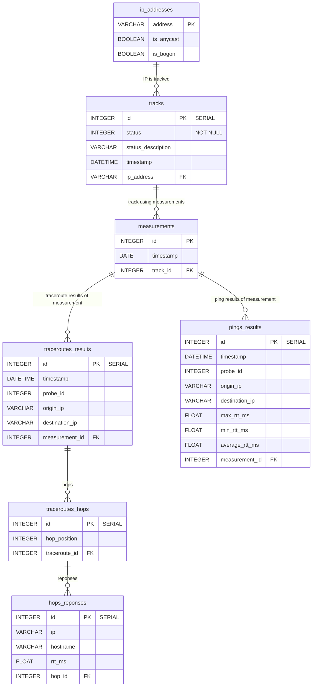

# Hunter Entity-Relationship Description

## Sistem description
This diagram shows the relations between database tables in the Hunter system.

## Entity-Relationship Diagram



### Symbols legend
- `PK`: Primary Key
- `FK`: Foreign Key
- `UK`: Unique Key
- `||--o{`: One-to-Many relation
- `}o--o{`: Many-to-Many relation

## Data ditionary


### Table: ``

| Column | Type | Description |
|--------|------|-------------|
|        |      |             |

```sql

```

### Table: `tracks`

| Column             | Type         | Description                                                                |
|--------------------|--------------|----------------------------------------------------------------------------|
| id                 | INTEGER (PK) | Unique ID of the track                                                     |
| status             | INTEGER      | Status of track execution. 0 if FINISHED, 1 if IN_PROGRESS and -1 if ERROR |
| status_description | VARCHAR      | Description of the current status of the track. If ERROR, an error message |

```sql
CREATE TABLE tracks (
    id SERIAL PRIMARY KEY,
    status INTEGER NOT NULL,
    ip_address VARCHAR NOT NULL REFERENCES ip_addresses(address) ON DELETE CASCADE,
)
```

### Table: `ip_addresses`

| Column     | Type         | Description                     |
|------------|--------------|---------------------------------|
| address    | VARCHAR (PK) | IP address                      |
| is_anycast | BIT          | BIT value for TRUE, 0 for FALSE |
| is_bogon   | BIT          | BIT value for TRUE, 0 for FALSE |

```sql
CREATE TABLE ip_addresses (
    address VARCHAR PRIMARY KEY,
    is_anycast BIT NOT NULL,
    is_bogon BIT NOT NULL
)
```

### Table: `pings`

| Column | Type | Description |
|--------|------|-------------|
|        |      |             |

```sql

```

### Table: `traceroutes`

| Columna    | Tipo         | Descripción                  |
|------------|--------------|------------------------------|
| id         | INTEGER (PK) | Unique ID  of the traceroute |
| timestamp  | DATETIME     | Date an time of execution    |
| origen_ip  | VARCHAR      | Origen IP                    |
| destino_ip | VARCHAR      | Destiny IP                   |

```sql
CREATE TABLE traceroutes (
    id SERIAL PRIMARY KEY,
    timestamp TIMESTAMP NOT NULL,
    origen_ip VARCHAR NOT NULL,
    destino_ip VARCHAR NOT NULL
);
```

### Table: `traceroute_hops`

| Columna       | Tipo         | Descripción                    |
|---------------|--------------|--------------------------------|
| id            | INTEGER (PK) | Unique hop ID                  |
| traceroute_id | INTEGER (FK) | Forming key of the traceroute  |
| hop_position  | INTEGER      | Hop position in the traceroute |

```sql
CREATE TABLE traceroutes_hops (
    id SERIAL PRIMARY KEY,
    traceroute_id INTEGER NOT NULL REFERENCES traceroutes(id) ON DELETE CASCADE,
    hop_position INTEGER NOT NULL
);
```

### Table: `hops_reponses`

| Columna     | Tipo          | Descripción                            |
|-------------|---------------|----------------------------------------|
| id          | INTEGER (PK)  | Unique hop response ID                 |
| hop_id      | INTEGER (FK)  | Foreing reference to hop               |
| ip_address  | VARCHAR       | IP address from the host which respond |
| hostname    | VARCHAR       | Hostname (opcional)                    |
| rtt_ms      | FLOAT         | Round Trip Time in ms                  |

```sql
CREATE TABLE hops_responses (
    id SERIAL PRIMARY KEY,
    hop_id INTEGER NOT NULL REFERENCES traceroutes_hops(id) ON DELETE CASCADE,
    ip_address VARCHAR NOT NULL,
    hostname VARCHAR,
    rtt_ms FLOAT
);
```
